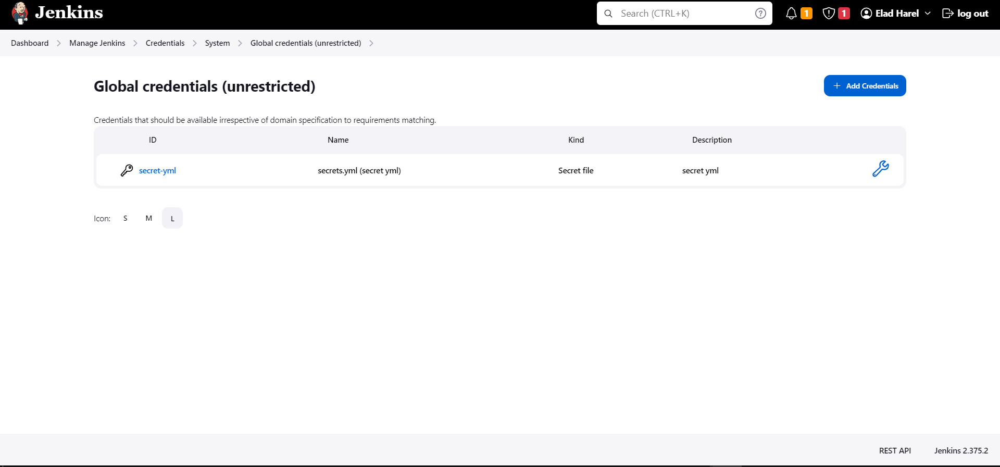
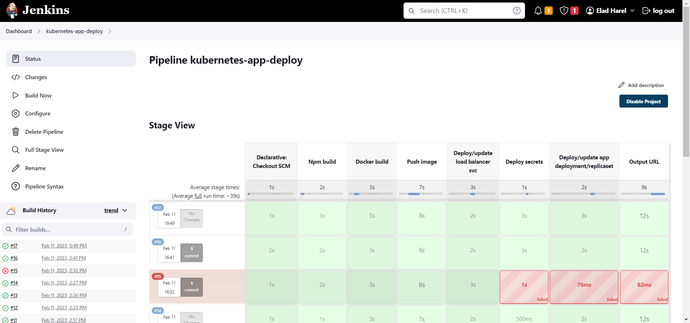
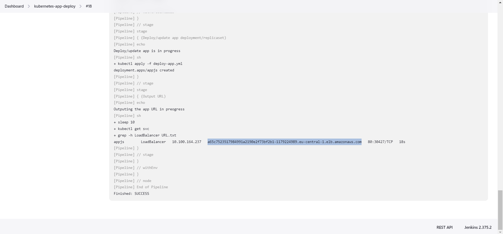
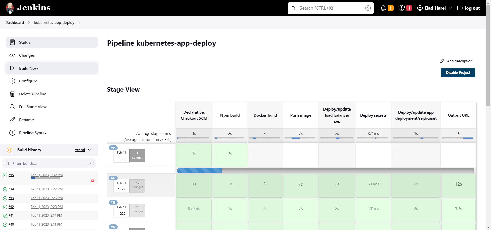

# Deploying App to K8S Cluster Using Jenkins declarative pipeline 


### In this project I used a Jenkins process based on Jenkins declarative pipeline to pull a repository from github, copile the code in it, make a docker image from it, push it to a private ECR and and deploy the app using EKS.

<hr>

## Prerequisites
* Account in AWS
* Set up an EKS on aws with at lease 2 t2.micro nodes
* Setting up ECR on AWS
* Jenkins with all the ECR and EKS credentials + kubectl, docker, AWS CLI and eksctl installed on it and make sure it has access to your github repo and able to push images to your ECR
* Big cup of coffee 😉☕ X5

## Jenkins:
1. Log in to your Jenkins server
2. Connect your Jenkins to your Github account using a private key(Github should have the public key) - This step can be skipped if the repo is public - [How to connect Github to Jenkins video](https://www.google.com/search?q=add+github+repository+to+jenkins&rlz=1C1TIGY_enIL721IL721&sxsrf=AJOqlzUv2b5Ha8EGuOo412ZIrwy0G9fe_Q:1675952999207&source=lnms&tbm=vid&sa=X&ved=2ahUKEwiy9LW504j9AhXJcKQEHXSAB5wQ_AUoAXoECAIQAw&biw=1536&bih=722&dpr=1.25#fpstate=ive&vld=cid:2b5124f4,vid:jSm0YZ-NQAc)
3. Create a new Jenkins Pipeline linked to your GitHub repository
4. Make a secret file with the id of 'secret-yml' that will contain a kubernetes yaml secret with your ECR credentials on it
    The file should look like this
    ```yaml
        apiVersion: v1
        kind: Secret
        metadata:
        name: ecr-secret
        namespace: default
        type: kubernetes.io/basic-auth
        data:
        username: "base64 access key"
        password: "base64 secret access key"
    ```


5. Add your credentials EKS credentials to your Jenkins


# Running the pipeline:
1. After making sure everything is set up to start you need to create a new Jenkins pipeline. this pipeline should be connected to the project git repo
2. Running the the pipeline, in this project we did not set a triggered pipelined (pipeline that will run at every commit to a specific branch) so you will manually run the pipeline.  
Jenkins will take you repo, clone it and then execute the stages we defined in the Jenkins file - NPM build -> Docker build -> Push image to ECR -> Deploy/update load balancer svc -> Deploy secrets -> Deploy/update app -> Output URL
### It should look like this:


<br>
3. If it fails you can view the logs and output to figure out what went wrong, and if it passed successfully you can find the link to app in the output.

### it should look like this:

<br>    

### Feel free to edit the app I kept it a simple 'hello world' this time and the output looks like this:


<br>    

# Summary
By going through all the steps and making sure you have the prerequisites you:
- Deployed an app to EKS pod while storing the image in ECR the app serves a 'hello world' page.
- All the stages from build, push to ECR and deploy on EKS where made with a Jenkins process based on Jenkins declarative pipeline.

### Feel free to contact me for questions or opinions about the project. 🤙

<br>

*** Note: I was not able to make the app accessible via port 443 (Https) within given time frame given to me for the task, I would appreciate it if someone can send me guide about tls/ssl certificates for EKS apps/ingress/lb 🙏
